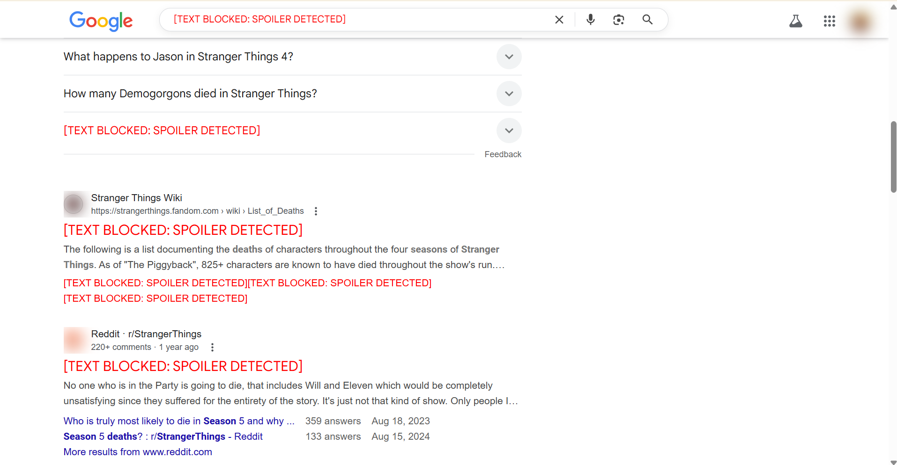

# :zap: Stranger Things Spoiler Blocker - Chrome Extension 

This Chrome extension helps protect you from **Stranger Things** spoilers lurking across the internet – including text reveals, plot twists, and key character deaths.  

It’s especially useful if you’re binge-watching late or waiting for a friend to catch up. 😅

> ## Keep Hawkins in the dark until you're ready for the truth.

This was built by a fan and developer who wanted to combine two of the best things: **technology + Netflix**.

---

# Features

- ✅ **Spoiler Detection**: Detects and hides spoiler phrases like `Vecna`, `Eddie dies`, `Max coma`, `Season 4 ending`, and more.
- 🔒 **Text Masking**: Hides spoiler text and replaces it with blacked-out content or warning message.
- 🖼️ **Visual Protection** _(optional)_ – Can be extended to blur spoiler-related images.
- 🧠 **Custom Keyword List**: Keywords are customizable in the source code.
- 👶 **Beginner-Friendly**: No expert Chrome dev knowledge needed to understand or modify it.
- 💻 **Open Source**: Feel free to fork and enhance.

---

# How to Use?

1. Clone or download this repository as a `.zip`
2. Unzip the folder
3. Open Google Chrome
4. Go to `chrome://extensions`
5. Enable **Developer Mode** (top right toggle)
6. Click on `Load Unpacked`
7. Select the unzipped project folder
8. You’ll see an icon  appear in the Chrome toolbar
9. Browse safely – even Reddit can't spoil you now!

---

# Why this Extension?

Built for:
- 🧲 Avoiding *Stranger Things* spoilers while rewatching or catching up
- 🧪 Learning how to build Chrome extensions
- 🧠 Gaining control over internet chaos

It’s a small, simple tool — but a life-saver if you’re spoiler-sensitive. 🛡️

---

